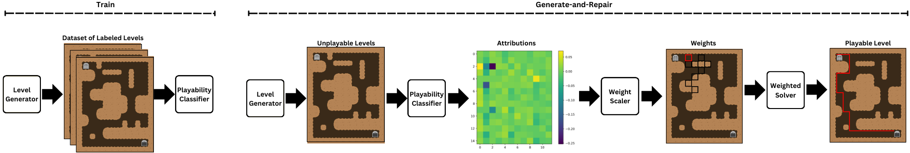

# Guided Game Level Repair via Explainable AI
## Abstract
Procedurally generated levels created by machine learning models can be unsolvable without further editing. Various methods have been developed to automatically repair these levels by enforcing hard constraints during the post-processing step. However, as levels increase in size, these constraint-based repairs become increasingly slow. This paper proposes using explainability methods to identify specific regions of a level that contribute to its unsolvability. By assigning higher weights to these regions, constraint-based solvers can prioritize these problematic areas, enabling more efficient repairs. Our results, tested across three games, demonstrate that this approach can help to repair procedurally generated levels faster.

## System Description

The main idea is that an explainable playability classifier will provide relative attributions for how much each tile contributes to the classification, and these attributions will be converted into penalty weights to guide the repair, such that tiles with **more** attribution to the classification have a **lower** weight and are thus less penalized for changing during the repair.  Ideally, this weighting information can be incorporated by the repairer to guide it to focus on locations that are more helpful to change, and thus more efficiently repair the level.

## Reference
You can find the full version of the paper on [Arxiv](https://arxiv.org/abs/2410.23101).

If you found this code useful, please consider citing our work:
```
@article{bazzaz2024guided,
  title={Guided Game Level Repair via Explainable AI},
  author={Bazzaz, Mahsa and Cooper, Seth},
  journal={arXiv preprint arXiv:2410.23101},
  year={2024}
}